# AdSpot Platform — Technical Architecture Flow

> **Audience:** Developers, DevOps
> **Edit with:** Any Markdown editor · [Mermaid Live](https://mermaid.live) · VS Code (Mermaid Preview extension)

```mermaid
flowchart TB
    subgraph CLIENTS ["⬛ Client Layer"]
        direction LR
        BROWSER["React SPA\nVite + Ant Design + Redux Toolkit\n(served from /public)"]
        TVAPP["TV / Screen App\nDedicated screen client\n(Android / Web player)"]
    end

    subgraph NGINX_LAYER ["🔀 Reverse Proxy"]
        NGINX["Nginx\n:80 / :443\n(SSL termination)"]
    end

    subgraph API ["⚙️ NestJS API — Express :3001"]
        direction TB

        subgraph AUTH_USERS ["Auth & Identity"]
            AUTH["AuthModule\nJWT · Passport · Bcrypt\nEmail verification · Screen login"]
            USERS["UsersModule\nAdmin · Advertiser · Publisher\nProfile · Role management"]
        end

        subgraph CONTENT ["Content & Media"]
            MEDIA["MediaModule\nMulter upload · Disk storage\nAdmin approval workflow"]
            CANVA["CanvaTemplatesModule\nOAuth 2.0 · Template sync\nDesign export to media"]
        end

        subgraph AD_CORE ["Advertising Core"]
            CAMPAIGNS["CampaignsModule\nCreate · Schedule · Status\nScreen assignment (M:N)"]
            SCREENS["ScreensModule\nRegistration · Search & filter\nCity / Venue / Rate lookup"]
            CHARGING["ChargingModule\nRate engine · Slot deductions\nPublisher credit"]
            PROGRAMMATIC["ProgrammaticModule\nDSP connections · RTB bidding\nImpression tracking"]
        end

        subgraph DELIVERY ["Screen Delivery"]
            TVMOD["TvAppModule\nHeartbeat · Campaign feed\nDevice config · Emergency override"]
            USBMOD["UsbExportModule\nOffline package builder\nHistory & download"]
            ANALYTICS["AnalyticsModule\nView recording · CTR\nSystem / Campaign / Screen reports"]
        end

        subgraph PLATFORM ["Platform Services"]
            PAYMENTS["PaymentModule\nCheckout session · Webhook handler\nMultiple gateway support"]
            NOTIF["NotificationsModule\nIn-app alerts · Email (SMTP)\nBull queue delivery"]
            LOGGING["LoggingModule\nActivity audit trail\nAdmin log viewer"]
            AICHAT["AiChatModule\nClaude AI assistant\nQuick replies"]
            I18N["I18nModule\nLanguages · Translations\nAdmin-managed"]
            LOC["LocationsModule\nCities · Regions · Venue kinds\nScreen geo-tagging"]
            BRAND["BrandingModule\nLogo · Theme settings"]
            LANDING["LandingModule\nPublic site content\nContact / Partner forms"]
            EARLYBIRD["EarlyBirdModule\nEarly access program\nUser tier management"]
        end
    end

    subgraph INFRA ["🗄️ Infrastructure"]
        direction LR
        MYSQL[("MySQL 8\nPrisma ORM\n40 models")]
        REDIS[("Redis 7\nBull job queues\nSessions / cache")]
        FILES[/"uploads/media/\nDisk storage\n(Docker named volume)"/]
    end

    subgraph EXTERNAL ["🌐 External Services"]
        direction LR
        CANVAAPI["Canva Connect API\nOAuth · Template library"]
        PAYEXT["Payment Gateways\nStripe · Razorpay\n(webhook verified)"]
        SMTP["SMTP Server\n(Ethereal fallback in dev)"]
        CLAUDE["Claude AI API\n(Anthropic)"]
    end

    BROWSER -->|"HTTPS REST API\nAuthorization: Bearer JWT"| NGINX
    TVAPP -->|"Screen Token (JWT)\nHeartbeat + Sync"| NGINX
    NGINX --> API

    AUTH_USERS --> MYSQL
    CONTENT --> MYSQL
    MEDIA --> FILES
    AD_CORE --> MYSQL
    AD_CORE --> REDIS
    DELIVERY --> MYSQL
    PLATFORM --> MYSQL
    NOTIF --> REDIS

    CANVA <-->|"OAuth + REST"| CANVAAPI
    PAYMENTS <-->|"Checkout + Webhook"| PAYEXT
    AUTH -->|"Verification email"| SMTP
    NOTIF -->|"Email alerts"| SMTP
    AICHAT <-->|"Messages API"| CLAUDE

    style CLIENTS fill:#e8eaf6,stroke:#3949ab
    style NGINX_LAYER fill:#f3e5f5,stroke:#6a1b9a
    style API fill:#e0f2f1,stroke:#00695c
    style INFRA fill:#fff8e1,stroke:#f57f17
    style EXTERNAL fill:#fce4ec,stroke:#880e4f
```

