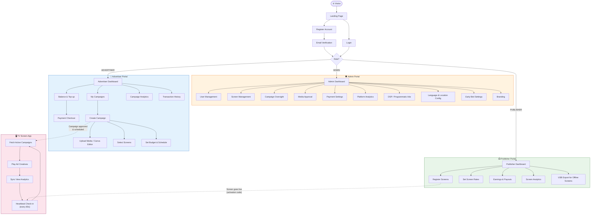

# AdSpot Platform — User Journey Flow

> **Audience:** Business / product stakeholders
> **Edit with:** Any Markdown editor · [Mermaid Live](https://mermaid.live) · VS Code (Mermaid Preview extension)

