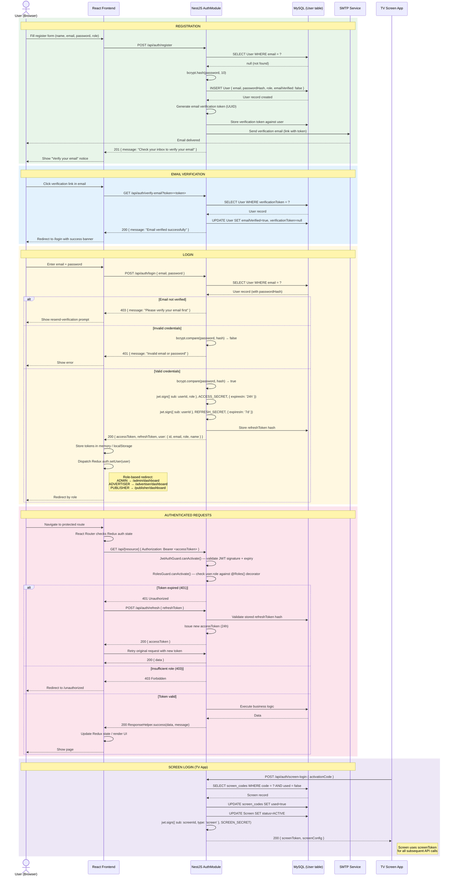

# AdSpot — Authentication Sequence Diagram

> **Audience:** Developers
> **Covers:** Register → Email Verify → Login → JWT issuance → Token refresh → Role-based routing
> **Edit with:** [Mermaid Live](https://mermaid.live) · VS Code Mermaid Preview

