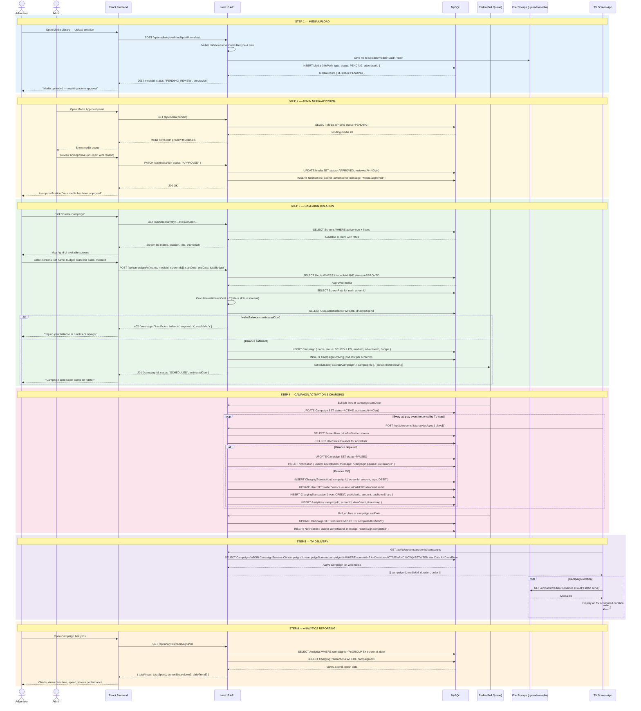

# AdSpot — Campaign Lifecycle Sequence Diagram

> **Audience:** Developers, Product
> **Covers:** Media upload → Admin approval → Campaign creation → Screen targeting → Scheduling → TV delivery → Analytics
> **Edit with:** [Mermaid Live](https://mermaid.live) · VS Code Mermaid Preview

