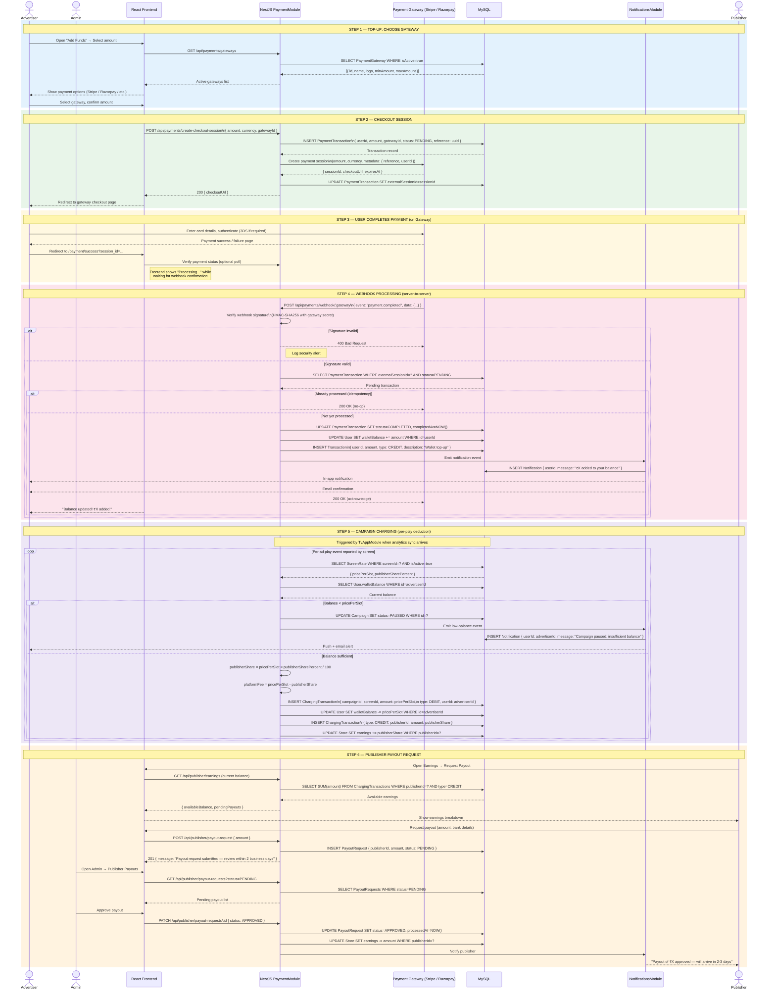

# AdSpot — Payments & Billing Sequence Diagram

> **Audience:** Developers, Finance
> **Covers:** Top-up flow → Gateway checkout → Webhook processing → Balance update → Campaign charging → Publisher payout
> **Edit with:** [Mermaid Live](https://mermaid.live) · VS Code Mermaid Preview

