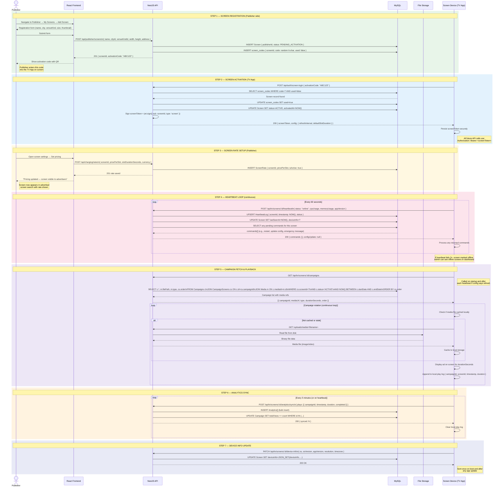

# AdSpot — TV Screen App Sequence Diagram

> **Audience:** Developers, DevOps
> **Covers:** Screen registration → Activation → Rate setup → Heartbeat loop → Campaign fetch → Playback → Analytics sync
> **Edit with:** [Mermaid Live](https://mermaid.live) · VS Code Mermaid Preview

